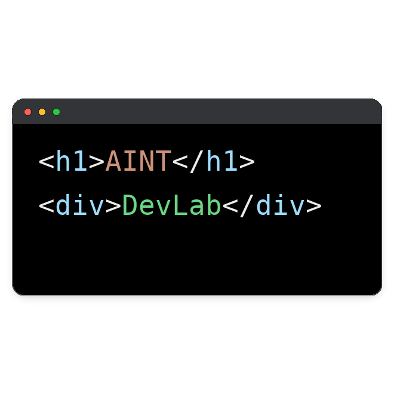

# AINT DevLab Logo

Este proyecto es un generador del logo para AINT DevLab, creado con Python y la biblioteca Pillow. 

El objetivo es demostrar que todo se puede automatizar, hasta la creación de nuestro logo, hecho con poco estilo pero mucha creatividad.

